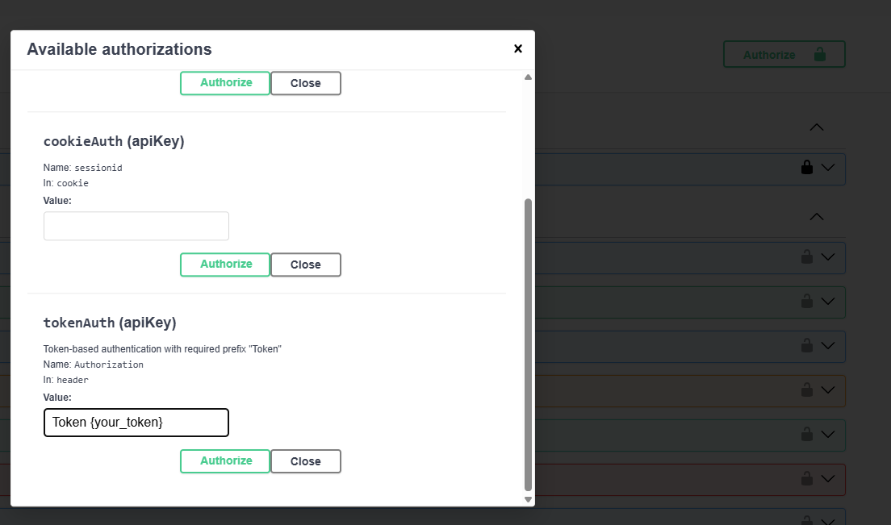

# recipe-app-api
Practicing Django and DRF by TDD
using course by LondonAppDeveloper
Course code for: [Build a Backend REST API with Python &amp; Django - Advanced](https://londonapp.dev/c2)

Run the project by
`docker-compose up`
Then you can create superuser
`docker-compose run --rm app sh -c "python manage.py createsuperuser"`
After that you can login in admin page
`http://localhost:8000/admin/`
And use schema in swagger
`http://localhost:8000/api/docs/`
In swagger you have to authorize by token. First post your superuser data in post
`/api/user/token/`
Copy you token and then paste it in Authorize on the top right of page

You can run tests by :
`docker-compose run --rm app sh -c "python manage.py test"`
